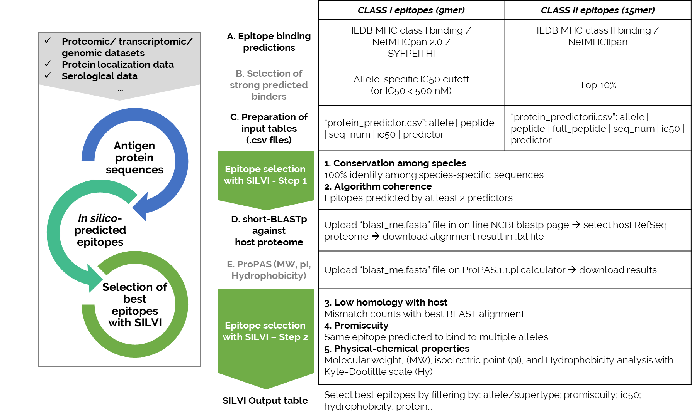

# SILVI
A  pipeline to facilitate in T-cell epitope selection 

## Citation
The paper describing this pipeline is available [here](link)

## Installation

Clone the repository locally with the command:
```
git clone https://github.com/loire/SILVI.git
```

## Purpose

Merge and filter results of immunoinformatics tools to facilitate discovery of epitopes

## Workflow




