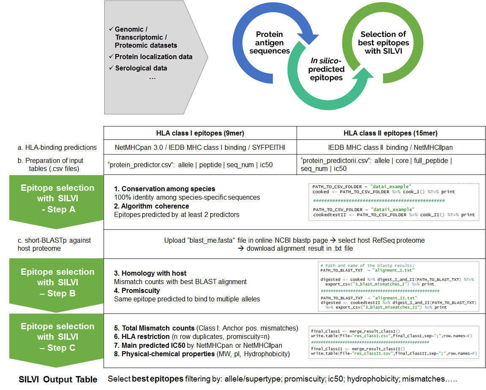

# SILVI
A  pipeline to facilitate in T-cell epitope selection 

## Citation
The paper describing this pipeline is available [here](link)

## Installation

Clone the repository locally with the command:
```
git clone https://github.com/loire/SILVI.git
```

## Purpose

To merge and filter HLA-binding prediction results from different immunoinformatics tools to facilitate discovery of epitopes

## Workflow



### R package dependancies:

tidyverse
stringr
Peptides

### General execution process

The scripts Fire_classI.R and Fire_classII.R contain the commands to apply analysis steps to class I or class II epitope binding prediction data, respectively. 
Path to input files should be edited by the user in Fire_classI.R or Fire_classII.R. We recommend loading the script files in Rstudio and execute each step sequentially.

The directory example contains a set of input files for both classes and the resulting output. 

* Download R (www.r-project.org), R studio (www.rstudio.com), package dependencies 
* Download SILVI 'code' and example data
TIP: Save all SILVI-related data files in the same directory


### INPUT - CLASS I EPITOPES:

First, users must provide results for proteins of interest generated by epitope binding programs.
Currently, the script only accept results from 9-mer epitopes for class I alleles.

The default online predictors expected by SILVI are:

* IEDB MHC-I binding [http://tools.iedb.org/mhci/](For each allele-length combination, consensus method is used, which includes ANN, SMM, and CombLib. Moutaftsi, M et al. 2006. A consensus epitope prediction approach identifies the breadth of murine T(CD8+)-cell responses to vaccinia virus. Nat Biotechnol 24:817-819.)
* NetMHCpan [http://www.cbs.dtu.dk/services/NetMHCpan/](Jurtz, V et al. 2017. NetMHCpan-4.0: Improved Peptide–MHC Class I Interaction Predictions Integrating Eluted Ligand and Peptide Binding Affinity Data. J. Immunol. 199, 3360–3368)
* SYFPEITHI [http://www.syfpeithi.de](Rammensee, HG et al. 1999.SYFPEITHI: database for MHC ligands and peptide motifs. Immunogenetics 50: 213-219)


Format your results files as csv 
* 4 columns: allele,peptides,seq_num,score
* comma separated
* Files name **MUST** be formated as: proteincode_predictorcode.csv 
* Move your files in a directory named data created in the working directory

### INPUT - FOR CLASS II EPITOPES: 

Similarly, users should obtain results from the online predictors.
Currently, the script only accept results from 15-mer  full-length epitopes with 9-mer cores for Class II alleles.

The default online predictors expected by SILVI are:

* IEDB MHC-II binding [http://tools.iedb.org/mhcii/](For each allele-length combination, consensus method is used, which includes NN, SMM, and CombLib: Wang, P et al. 2008. A systematic assessment of MHC class II peptide binding predictions and evaluation of a consensus approach. PLoS Comput Biol. 2008 Apr 4;4(4):e1000048. | NN-align core and IC50 predictions: Wang, P et al. 2010. Peptide binding predictions for HLA DR, DP and DQ molecules. BMC Bioinformatics 11, 568)
* NetMHCIIpan [http://www.cbs.dtu.dk/services/NetMHCIIpan/](Andreatta, M et al. 2015. Accurate pan-specific prediction of peptide-MHC class II binding affinity with improved binding core identification. Immunogenetics.67(11-12):641-50.)

Format your results files as csv 
* 6 columns: allele,seq_num,full_peptide,rank,core,ic50
* semi-colon separated
* Files name **MUST** be formated as: proteincode_predictorcode.csv 
* Move your files in a directory named data created in the working directory


INPUT TIPS:
We recommend users use pathogen- or disease-specific information to guide epitope selection, so HLA-binding prediction lists can be optimised before submitting to SILVI. 
Users should start with highly antigenic protein candidates, abundant and with adequate expression dynamics, and can pre-filter information according to predicted IC50 (general or allele-specific cut-off values), by antigenic region or any other relevant features.


### SILVI - STEP 1

To apply the first filtering step, SILVI imports and integrates all data into a single data frame class in R.
SILVI directly compares all 9-mer peptides or cores among different sequences from the same protein (several seq_num per protein).
The script selects 9-mer peptides or cores that are 100% identical (common_among_seq_nums filter). 
Simultaneously, the script selects only the 9-mer peptides or cores predicted by at least 2 predictors (common_among_predictors filter). 
All predicted HLA restrictions are added to the exported table (new column: supertype). 


FOR CLASS I:
- users open Fire_classI.R, 
- introduce the pathway to input files and run the first code lines. 
To assign HLA restriction, the comparison is made per supertype (11 supertypes), which allows the comparison among predictors 50. 
In the file /code/map_supertype_alleles.csv, we find the correspondences between allele and supertypes (11), where users may add new alleles. 
HLA-restriction is kept when is predicted by at least 2 algorithms; if not, promiscuity=0


FOR CLASS II:
 - users open Fire_classII.R, 
 - introduce the pathway to input files and run the first code lines. 
 To assign HLA restriction, SILVI compares per allele, so it is important to perform predictions with the same allele lists. 


### Intermediate Output

As an intermediary output, the script generates a .csv file for the initial epitope list (“1_common_I/II.csv”) with all the dataframe information so far (source protein, all predicted allele/supertype restrictions, peptide sequence, number of predictors, number of seq_nums, scores and raw data file). 
Also, a .txt file with all 9-mer peptides in FASTA format is generated, to be subsequently uploaded for online short-BLASTp analysis:
```
“1_blast_me.fasta”
```

The 9-mer peptides included in this file correspond to epitopes conserved among species (seq_nums) and predicted by at least 2 algorithms.     

For  class I, the first step of the script output the following files:
``` 
1_common_I.csv
```
	Formatted prediction for class I supertype in a csv file.
```
1_blast_me.fasta
```
	File containing peptide sequences in fasta format to blast against host proteome.

For  class II, the first step of the script output the following files:
```
1_common_II.csv
```
	Formatted prediction for class II supertype in a csv file.
```
1_blast_me.fasta
```
	File containing peptide sequences in fasta format to blast against host proteome.


### BLAST - CLASS I & CLASS II 

Users upload '1_blast_me.fasta' file in the online protein BLAST page (https://blast.ncbi.nlm.nih.gov/Blast.cgi)
Users choose the host reference dataset and desired alignment parameters. 
	EXAMPLE: 
	Database: Reference proteins (refseq_protein)
	Organism = Homo sapiens taxid: 9606
	Algorithm parameters= default (changes automatically to default for short sequences)

Once the alignment is complete, users download the short-BLASTp alignment result (top tab 'Download' aligment)in .txt file format to be imported again in R for SILVI's step 2. 


### SILVI - STEPS 2 and 3 

Users introduce the path and name of the short-BLASTp result file and run the #STEP2 code. 

SILVI reads the first BLASTp alignment hit for each 9-mer peptide or core and counts the position-specific mismatches. 
Positive residues are considered a match, and when alignment gaps are introduced, the succeeding positions are considered as mismatch.

Once the new dataframe is generated by the 2nd selection step, users run the #STEP3 code lines and SILVI calculates the total number of mismatches in each peptide (new column: “totalMM”), as well as supertype-specific anchor position mismatches for class I peptides (new column: “anchorMM”). 

Moreover, SILVI calculates the “promiscuity”, the total number of alleles/supertypes to which a given epitope is predicted to bind to, and duplicates the rows according to this information allowing selections based on HLA-restriction (new column: "HLA-restriction"). 
Also, SILVI highlights the predicted IC50 by NetMHCpan algorithms (new column: “scoreN”) to help the user select the top predicted binders.

SILVI also runs Peptides on all 9-mer or 15-mer peptide sequences to add molecular weight (MW), isoelectric point (pI) and hydrophobicity (Hy). 


### SILVI - Final output

As a final output, SILVI generates a .csv file containing the initial peptide list from the first selection step, plus the short-BLASTp alignment results and all the other relevant information added in the last selection steps. 
The user is then free to analyse the list, complement with more data if needed, and prioritize the different criteria as desired.

For  class I, the last steps of the script output the following file:
```
res_classI.csv
```
containing the following columns:
predictor;seq_num;score;blast_info;file;Hydrophobicity;pI;MW;mismatch;promiscuity;Num_predictor;hasI;hasN;hasS;HLA_restriction;scoreN;anchormm

For  class II, the last steps of the script output the following file:
```
res_classII.csv
```
* containing the columns: 
allele;full_peptide;peptide;middle;middle2;subject;m_1;m_2;m_3;m_4;m_5;m_6;m_7;m_8;m_9;protein;predictor;seq_num;score;blast_info;file;Hydrophobicity;pI;MW;mismatch;promiscuity;Num_predictor;hasI;hasN;HLA_restriction;scoreN

### FILTERING RECOMMENDATIONS

Users are urged to apply filtering criteria according to their data and specific needs.

As general guidelines:
* Binding affinity predictions are good filters for excluding non-binding peptides. 
	Frequently used cut-off values: 
	strong binder (IC50 < 50 nM)
	binder (IC50 < 500 nM)
	low stringency binder filter (IC50 < 1000 nM)
	allele-specific binding affinity cutoff values information in IEDB (https://help.iedb.org/hc/en-us/articles/114094151811-Selecting-thresholds-cut-offs-for-MHC-class-I-and-II-binding-predictions)

* Promiscuity, the ability to bind to several alleles, is a good criteria to select the most immunogenic peptides. Promiscuity >= 1 means the same HLA restriction was predicted by at least 2 algorithms.
* Total mismatches and anchor mismatches filters help reject epitopes that may induce cross-reactions or auto-immunity.
* Hydrophobicity filters help in the selection of soluble peptides, advantageous for subsequent peptide solubilization and in vitro or in vivo assays.
* The application of low stringency filters will significantly reduce final epitope lists, but they may still contain a high number of non-immunogenic epitopes. Final epitope lists may be further analysed by epitope-specific analysis tools, such as class-I immunogenicity tool (http://tools.iedb.org/immunogenicity/) or CD4 T cell immunogenicity prediction tool (http://tools.iedb.org/CD4episcore/), and others, according to the user's preferences. 

* example filters for class I epitopes:
	promiscuity >= 1
	scoreN < 2500
	total mismatch >=2
	hydrophobicity <= 2
	hydrophobicity >= -1,5
	

* example filters for class II epitopes: 
	promiscuity >= 1
	scoreN < 2000
	total mismatch >= 2
	hydrophobicity <= 1,5
	hydrophobicity >= -1,5
	

* sensitivity and specificity of different SILVI filters for example protein P26664:


